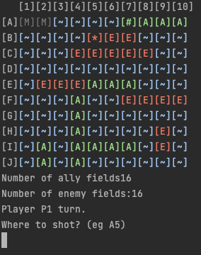

BattleShips game from scratch:

3 Game modes:

- <b>Pvp</b> -> Player vs Player
- <b>PvA</b> -> Player vs Ai
- <b>AvA</b> -> Ai vs Ai

Ideas to do:

- Ranking for person groups per table
- AI player - computer mode player
   - Improve AI (if meet ship - then attack in cross pattern +1, -1 in (x,y))
   - Really its need to be talented to lost with this ''AI' :-)
- Omit the stupid action in AI vs AI mode:

    - Hey its already missed, don't waste energy!
    - Its your ship already attacked!
    - Its enemy ship already attacked"